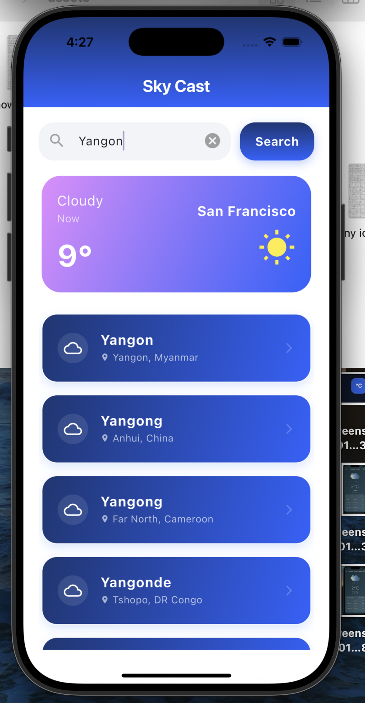
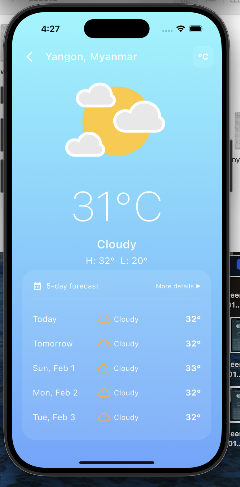
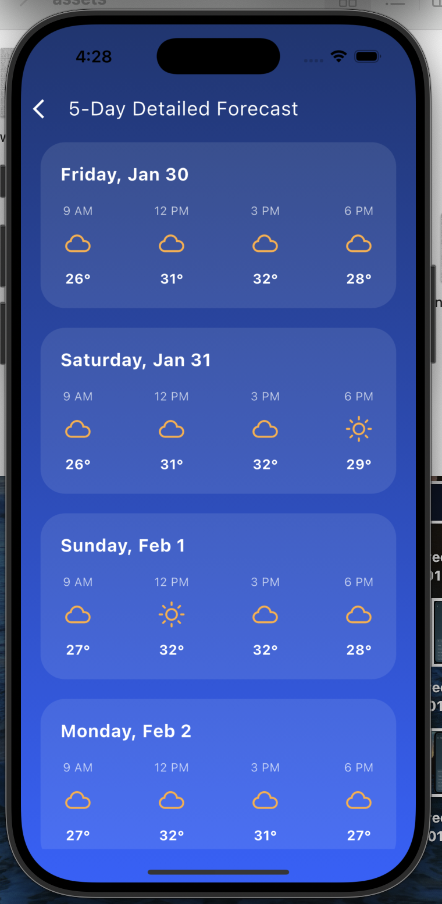
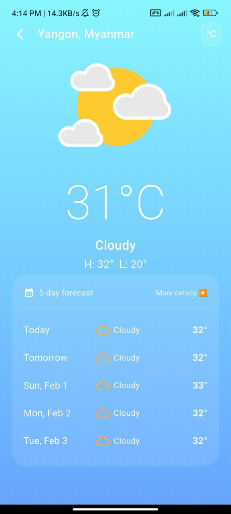
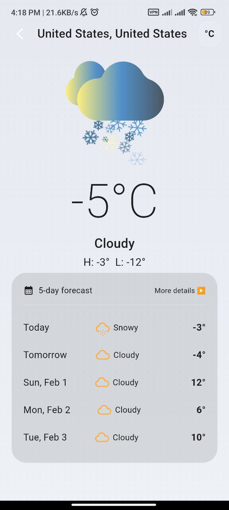
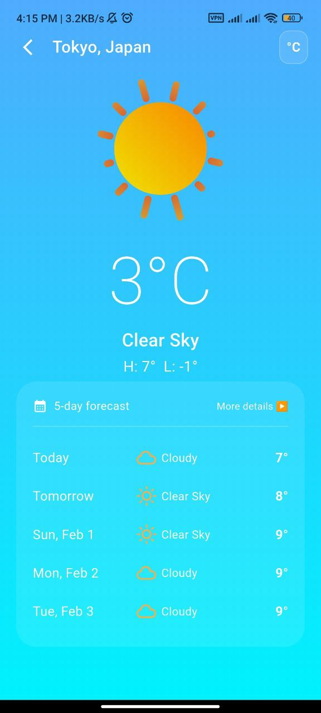

# 🌤️ Sky Cast – Weather App (Flutter)

Thank you for your interest in my application and for the opportunity to complete this technical code test.  
This repository contains my solution for the **Sky Cast – Weather (Flutter)** assignment, along with a brief explanation of my technical approach and assumptions, as requested.

---

## 📌 Project Overview

**Sky Cast** is a Flutter-based weather application that allows users to search for weather information by city name or automatically retrieve weather data based on their current geographic location. The app focuses on clean UI, robust error handling, and production-ready architecture.

- **Language:** Dart
- **Framework:** Flutter
- **State Management:** Riverpod
- **Weather API:** Open-Meteo

---
## 📱 UI Screenshots
### 🔍 City Search Screen with Geolocation


### 🌤️ Current Weather Display Screen


### 📊 5-day Detailed Forecast (More Details)


## 🌐 Weather API Integration

I selected **Open-Meteo.com** as the weather API provider.

**Reason for Choice:**
- Open-source and free to use
- No API key required for the standard tier
- Simplifies setup and evaluation for reviewers

**Implementation Details:**
- **Geocoding API:** Converts city names into latitude and longitude
- **Forecast API:** Fetches current weather and multi-day forecast using coordinates

---

## ✅ Features & Requirement Mapping

### Part 1: Core Functionality (Mandatory)

#### 1. City Selection / Search Screen
- Clear text input field for city name
- Search button to trigger weather fetch
- Debounced input to avoid unnecessary API calls

#### 2. Current Weather Display Screen
- Displays:
    - City name and country
    - Current temperature
    - Weather condition (e.g., Sunny, Cloudy)
    - Icon or animation representing the condition
- Celsius / Fahrenheit button (implemented as an enhancement)
- **5-day forecast**, including:
    - Date and time
    - Temperature
    - Weather condition 
    - Weather icon/description

#### 3. Error Handling & Loading States
- Loading indicators during API calls
- User-friendly error messages
- Retry option available for network-related errors

---

### Part 2: Enhancements (Implemented)

- ✅ **State Management:** Riverpod with `StateNotifierProvider` and `AsyncValue`
- ✅ **Animations:** Weather-based Lottie animations
- ✅ **Dynamic UI Theming:** Gradient backgrounds adjusted to weather conditions
-   
  
  
- ✅ **Geolocation:** Automatic weather fetch based on user’s current location with permission handling
- ### 📊 Detailed Weather Insights (Enhancement)

- **Sequential API Flow:**  
  The app follows a two-step data-fetching process. It first retrieves geocoding data to accurately resolve latitude and longitude, then triggers the weather forecast request using those exact coordinates. This ensures precise and reliable weather results.

- **Curated Hourly Forecast:**  
  In the **“More Details”** screen, a custom filtering strategy is applied. Instead of displaying all 24 hourly data points, the UI highlights key time slots (**9 AM, 12 PM, 3 PM, and 6 PM**) to provide a clean, readable, and high-impact daily overview.

---

## 🛠️ Architecture & Technical Approach

I implemented a Feature-First Clean Architecture to ensure the project meets high standards of Code Quality and Maintainability, as requested in the evaluation criteria. This structure organizes code by functionality (e.g., the weather feature) rather than just by technical type, making it highly scalable.

### 📂 Feature-First Structure

The project is organized into modular features, each containing its own internal layers:

- **Data Layer:**  
  Responsible for API communication via Dio, JSON parsing, and mapping raw data into Models. This layer acts as a "translator," converting technical DioException types into user-friendly strings for the UI.

- **Domain Layer:**  
  The heart of the feature. It contains the core Entities and Abstract Repository interfaces. This layer is purely Dart-based and independent of external libraries or UI frameworks.

- **Presentation Layer:**  
  Organized into screens, widgets, and providers. It focuses on rendering the state using Riverpod and handling user interactions with high performance.


## 🔄 State Management Flow (Riverpod)
The application uses Riverpod to manage the lifecycle of weather data:

- **Trigger:**  
  The UI (Search or Display screen) calls the WeatherNotifier.

- **Logic:**  
  The Notifier manages a CancelToken to stop redundant background requests and sets the state to `AsyncValue.loading()`.

- **Data Fetch:**  
  The Repository fetches data through the Singleton Dio instance.

- **Reaction:**  
  Upon success, the UI reactively updates to display the weather; upon failure, a dedicated error state is triggered with a "Retry" option.

---

## 💡 Key Technical Decisions

- **Singleton Dio Instance:**  
  I implemented a centralized network client using a `static final` Dio instance. This ensures connection socket reuse, significantly improving performance and preventing "connection limit" errors during rapid searches.

- **Debounced Search Strategy:**  
  To optimize API usage and enhance user experience, I implemented a Debouncer (using a Timer) for the city search functionality. This ensures that network requests are only triggered after the user has stopped typing for 600ms, preventing redundant API calls for every keystroke.

- **Unified State Management (Riverpod):**  
  I utilized Riverpod's StateNotifierProvider to handle asynchronous weather data. By using AsyncValue, the UI reactively handles loading, data, and error states without manual setState logic for data fetching.

- **Separation of Concerns:**  
  The project follows a clean architecture by separating the Geocoding logic  into a dedicated LocationService. This keeps the UI widgets lean and focuses them entirely on presentation.

---

## 📂 Project Directory Structure

```text
lib/
├── features/
│   └── weather/           # Main functional feature
│       ├── data/          # Dio implementation & WeatherModel
│       ├── domain/        # Repository interfaces & Weather entity
│       └── presentation/  # Screens, utils, & Riverpod Providers
├── core/                  # Theme mappers, animations, & location services
└── main.dart              # App entry point with ProviderScope
```
---

## 📦 Installation & How to Run

You can run **Sky Cast** in two ways: **APK installation** or **from source**.

### 1️⃣ Install APK (Android)

1. Download the APK from this link:  
   [Download Sky Cast APK](https://drive.google.com/file/d/1TqOF4-mbeahp6CN91PwTIfAZJ3vGf-Xe/view?usp=drive_link)

2. Enable **Install from Unknown Sources** on your device.

3. Open the APK and launch the app.

---

### 2️⃣ Run from Source

1. Clone the repository:  

git clone [https://github.com/Khant-haythi/sky-cast-weather.git]

2. Navigate to the project folder:
cd sky-cast-weather-app

3. Install dependencies:
flutter pub get

4. Run the app:
flutter run
